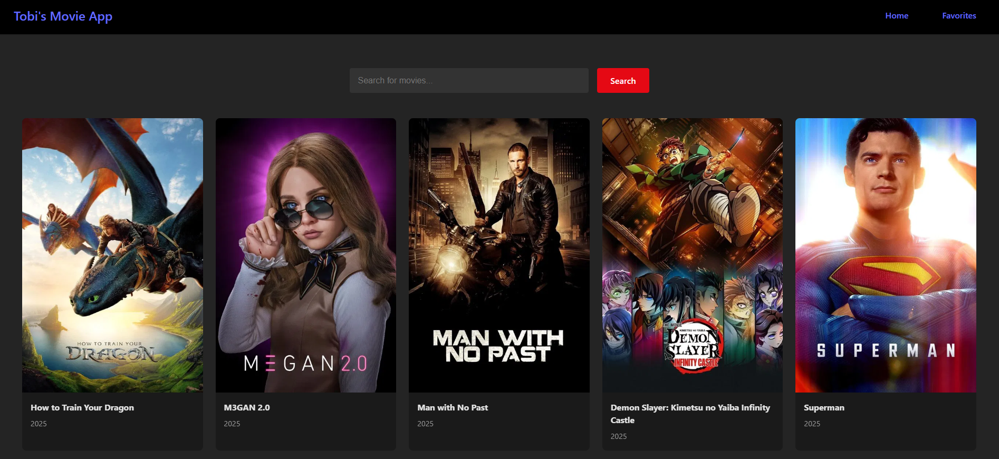

## React Movie App 🎬

A modern movie listing application built with **React** and **Vite**. This app displays a collection of movies with titles, posters, and brief details. Designed with scalability and clarity in mind using component-based architecture and clean styling.

<br>



## Features

- Built with Vite for fast development and optimized builds
- Functional React components with JSX
- Dynamic rendering of movie items using an array
- Clean and responsive UI styling with CSS
- Project structure designed for scalability

## Screenshot


### Favorites Page


## Tech Stack

- React 18+
- Vite 7+
- JavaScript (ES6+)
- HTML5 & CSS3

## Setup Instructions

1. **Clone the repository**
   ```bash
   git clone https://github.com/tobifotis/react-movie-project.git
   cd react-movie-project
   ```

2. **Install dependencies**
   ```bash
   npm install
   ```

3. **Run the development server**
   ```bash
   npm run dev
   ```

4. **View the app**
   Open your browser and visit: [http://localhost:5173](http://localhost:5173)


## Developer

**Tobi Emmanuel**  
[oluwatobiemmanuel.com](https://oluwatobiemmanuel.com)

## License

This project is licensed under the [MIT License](LICENSE).
